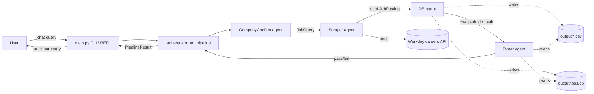
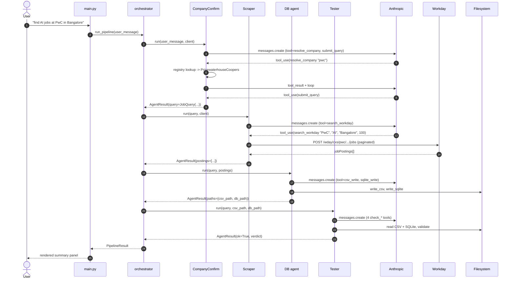

# System Design

Engineering reference for `job-chatbot-anthropic-sdk`. Covers the
architecture, the agent boundaries, the Anthropic tool-use loop, the
persistence layer, and where to extend the system.

---

## Problem statement

Most large enterprise careers sites are hosted on Workday, but Workday's
front-end is awkward to use across companies: filters differ per tenant,
links rot, location facets are inconsistent, and there's no cross-company
way to pull "all current AI roles at the five companies I care about".

Workday does expose a public JSON search endpoint
(`POST /wday/cxs/{tenant}/{site}/jobs`) but writing a per-company script
each time is tedious and the results are unstructured.

This project wraps that endpoint behind a single natural-language CLI. A
user types `find AI jobs at PwC in Bangalore`; an LLM-orchestrated pipeline
(1) figures out which company they mean, (2) calls the Workday endpoint
with the right keywords and location filter, (3) persists the results as
CSV + SQLite, and (4) validates the output before reporting back.

The design uses **separate Claude calls per stage** rather than one giant
prompt with every tool. Each stage has a narrow system prompt and a
narrow tool list, which is easier to debug, easier to test, and easier to
extend.

---

## High-level architecture



End-to-end sequence for a single query:



The orchestrator is **plain Python with no LLM** (`orchestrator.run_pipeline`
in `src/job_chatbot_anthropic_sdk/orchestrator.py`). It owns the data flow
between stages and the early-exit logic on failure. The LLM only acts
inside each individual agent.

---

## Component breakdown

### CompanyConfirm agent

- **File:** `src/job_chatbot_anthropic_sdk/agents/company_confirm.py`
- **Role:** Turn a free-form user message into a normalized `JobQuery`
  (canonical company name + keywords + optional location + limit).
- **Model:** `claude-haiku-4-5-20251001`
- **Tools exposed to Claude:**
  - `resolve_company(name)` — look up an alias in the registry, return the
    canonical name and Workday tenant/site or `null`.
  - `submit_query(company, keywords, location, limit, notes)` — final
    structured output. Called exactly once.
- **Input:** raw user string.
- **Output:** `AgentResult(agent="company_confirm", ok=…, data={"query": {…}})`
- **Failure modes:** company alias not in registry, model refuses to call
  `submit_query`, model returns empty `company`. All three short-circuit
  the pipeline.

Sketch:

```python
MODEL = "claude-haiku-4-5-20251001"
def run(user_message, client):
    messages = [{"role": "user", "content": user_message}]
    for _ in range(6):  # safety bound on the loop
        resp = client.messages.create(model=MODEL, system=SYSTEM_PROMPT,
                                      tools=TOOLS, messages=messages, ...)
        messages.append({"role": "assistant", "content": resp.content})
        if resp.stop_reason != "tool_use": break
        # execute tool_use blocks, append tool_result blocks, loop
```

### Scraper agent

- **File:** `src/job_chatbot_anthropic_sdk/agents/scraper.py`
- **Role:** Given a `JobQuery`, call the Workday search endpoint and return
  the resulting `JobPosting` list.
- **Model:** `claude-haiku-4-5-20251001`
- **Tools:**
  - `search_workday(company, keywords, location, limit)` — wraps
    `tools.workday.search_jobs`. The real HTTP call happens in Python; the
    tool returns `{count, sample[]}` to Claude and stashes the full list
    in a Python-side sink.
  - `report_results(count, notes)` — final acknowledgment.
- **Input:** `JobQuery`.
- **Output:** `AgentResult(data={"postings": [...], "report": {...}})`.
- **Failure modes:** company missing from registry (defensive — should have
  been caught upstream), Workday returns zero results (`ok=False`), HTTP
  timeout or 5xx (propagates as an exception caught by `main.py`).

### DB agent

- **File:** `src/job_chatbot_anthropic_sdk/agents/db.py`
- **Role:** Persist the in-memory postings to CSV + SQLite.
- **Model:** `claude-haiku-4-5-20251001`
- **Tools:**
  - `csv_write(company_slug, keyword_slug)` — writes the timestamped CSV;
    wraps `tools.storage.write_csv`.
  - `sqlite_write(company_slug)` — upserts into `output/jobs.db`; wraps
    `tools.storage.write_sqlite`.
  - `report_paths(csv_path, db_path)` — final acknowledgment.
- **Input:** the `JobQuery` and the in-memory `list[JobPosting]` from the
  scraper.
- **Output:** `AgentResult(data={"paths": {"csv_path", "db_path"}, ...})`.
- **Failure modes:** disk full / permission denied (raises), Claude only
  calls one of `csv_write`/`sqlite_write` (caught by checking both paths
  are present before returning `ok=True`).

### Tester agent

- **File:** `src/job_chatbot_anthropic_sdk/agents/tester.py`
- **Role:** Re-open the CSV and SQLite, sanity-check them, and emit a
  pass/fail verdict.
- **Model:** `claude-haiku-4-5-20251001`
- **Tools:**
  - `check_csv_schema(csv_path)` — header columns must equal
    `EXPECTED_CSV_COLUMNS`.
  - `check_csv_rows(csv_path)` — must be `> 0`.
  - `check_csv_dedup(csv_path)` — `duplicates` must be `[]`.
  - `check_sqlite_rows(db_path, company)` — must be `> 0`.
  - `report_verdict(passed, notes)` — final acknowledgment.
- **Input:** the `JobQuery` plus both filesystem paths.
- **Output:** `AgentResult(data={"findings": {...}, "verdict": {...}})`.
- **Failure modes:** any check fails → Claude is expected to call
  `report_verdict(passed=False)`. If the model never calls `report_verdict`,
  the agent reports a generic failure.

---

## The Anthropic tool-use loop

Each agent uses the same SDK pattern, repeated up to ~6–8 times:

```python
for _ in range(N):
    resp = client.messages.create(model=MODEL, system=SYSTEM_PROMPT,
                                  tools=TOOLS, messages=messages, ...)
    messages.append({"role": "assistant", "content": resp.content})
    if resp.stop_reason != "tool_use":
        break
    # gather tool_use blocks from resp.content, execute each in Python,
    # append a single user message whose content is a list of tool_result
    # blocks (one per tool_use), then loop.
```

The loop terminates when Claude returns `stop_reason="end_turn"` (it's done)
or when a sentinel tool (e.g. `submit_query`, `report_verdict`) is called.
Each agent caps the loop at a small constant to prevent runaway behaviour.

### Why one Claude call per agent, not one big prompt?

- **Narrow tool surface.** Each agent sees only the 2–5 tools relevant to
  its job. Smaller surface = less chance the model picks the wrong tool.
- **Independent prompts.** The Scraper's prompt can be tuned without
  affecting Tester behaviour.
- **Debuggability.** When something goes wrong, the per-stage
  `AgentResult.summary` tells you exactly which agent failed.
- **Cheap retries.** A failed Tester run could be retried in isolation
  without re-scraping; the data is already on disk.
- **Composability.** Agents can be replaced by deterministic Python in the
  future (e.g. swap CompanyConfirm for a pure regex) without touching the
  rest.

The trade-off is more wall-clock latency (4 round trips instead of 1) and a
slightly higher token cost, but with Haiku that overhead is on the order of
a cent per query.

---

## Tools layer

### `tools/workday.py`

Thin HTTP client for the Workday public search endpoint.

- Endpoint: `POST {base_url}/wday/cxs/{tenant}/{site}/jobs`
- Body: `{"appliedFacets": {}, "limit": 20, "offset": <n>, "searchText": "<kw>"}`
- Pagination: increments `offset` by `_PAGE_SIZE` (20) until either `limit`
  results have been collected or `offset >= total`.
- Filtering: keyword filter is server-side (`searchText`); location filter
  is client-side substring match on `locationsText` (because Workday's
  location facets are inconsistent across tenants).

The job-ID regex:

```python
_JOB_ID_RE = re.compile(r"_([A-Z0-9-]+WD)(?:-\d+)?$")
```

It captures the trailing canonical Workday job ID (e.g. `712616WD`) and
deliberately **strips any `-1`/`-2` suffix**. Workday sometimes surfaces
the same underlying role on multiple careers sub-sites with different
suffixes; stripping them lets the SQLite primary key
`(company, job_id)` deduplicate the same role automatically.

### `tools/companies.py`

Static registry of supported companies, plus an alias map.

```python
@dataclass(frozen=True)
class Company:
    canonical_name: str
    base_url: str
    tenant: str
    site: str
```

`resolve_company(name)` normalises whitespace + case and looks up the input
in both the main registry and the alias map. `known_companies()` returns
the sorted canonical names for help text.

### `tools/storage.py`

CSV and SQLite writers, plus the small read helpers used by the Tester.

- **CSV column order** (constant `_CSV_COLUMNS`, exported as
  `EXPECTED_CSV_COLUMNS`):
  `company, job_id, title, location, posted_on, url`.
- **CSV filename:** `{company_slug}_{keyword_slug}_{YYYY-MM-DD}.csv`. Slugs
  collapse non-alphanumerics to underscores and lowercase everything.
- **SQLite schema:** see below.
- **Idempotent upsert:** `INSERT ... ON CONFLICT(company, job_id) DO UPDATE`
  so running the same query twice doesn't grow the table.

---

## Data model

All in `src/job_chatbot_anthropic_sdk/models.py`:

```python
@dataclass
class JobQuery:
    company: str            # canonical name, e.g. "PricewaterhouseCoopers"
    keywords: str           # e.g. "AI", may be ""
    location: str | None    # e.g. "Bangalore", or None
    limit: int = 100

@dataclass
class JobPosting:
    company: str            # canonical name
    job_id: str             # e.g. "712616WD"
    title: str
    location: str           # free text from the careers site
    posted_on: str          # site-formatted date
    url: str                # absolute URL

@dataclass
class AgentResult:
    agent: str              # "company_confirm" | "scraper" | "db" | "tester"
    ok: bool
    summary: str            # one-line human-readable status
    data: dict              # agent-specific payload
```

`PipelineResult` (in `orchestrator.py`) wraps a `list[AgentResult]` plus an
`artifacts` dict and renders a multi-line summary for the REPL.

---

## Sequence: a single query end-to-end

Walkthrough for `find AI jobs at PwC in Bangalore`:

1. **REPL** (`main.py`) reads the line, calls `orchestrator.run_pipeline`.
2. **CompanyConfirm** sends the raw text to Claude with the
   `resolve_company`/`submit_query` tools. Claude:
   a. Calls `resolve_company("PwC")`. Python returns
      `{canonical_name: "PricewaterhouseCoopers", tenant: "pwc",
      site: "Global_Experienced_Careers", ...}`.
   b. Calls `submit_query(company="PricewaterhouseCoopers", keywords="AI",
      location="Bangalore", limit=100)`. The agent stores this and exits
      the loop. Returns `JobQuery(...)`.
3. **Scraper** receives the `JobQuery`, sends it to Claude with the
   `search_workday` tool. Claude calls `search_workday(...)`. Python:
   a. Re-resolves the company to get the Workday tenant/site.
   b. POSTs the Workday endpoint repeatedly, paginating with
      `offset += 20`, until the result count plateaus or `limit` is hit.
   c. Filters each posting by location substring; drops duplicates by
      cleaned `job_id`.
   d. Returns the count + a 3-row sample to Claude. Claude calls
      `report_results(count=17)`.
4. **DB** receives the postings list (in Python — not via Claude — for
   data integrity). Claude is just asked to choose the slugs and call the
   write tools. Two file artifacts result:
   - `output/pricewaterhousecoopers_ai_2026-05-25.csv`
   - `output/jobs.db` (table `postings` upserted)
5. **Tester** is given both paths. Claude runs `check_csv_schema`,
   `check_csv_rows`, `check_csv_dedup`, `check_sqlite_rows` in any order,
   then `report_verdict(passed=True)`.
6. **Orchestrator** assembles a `PipelineResult` and returns to the REPL,
   which prints it in a rich panel.

---

## Persistence layer

### CSV

- One file per query.
- Filename pattern: `{company_slug}_{keyword_slug}_{YYYY-MM-DD}.csv` in
  `output/`.
- UTF-8 encoded, no BOM, comma-delimited, header row included.
- Columns in this exact order (enforced by the Tester):
  `company, job_id, title, location, posted_on, url`.
- The Scraper already de-duplicates by `job_id`, so the CSV is guaranteed
  to have no duplicate IDs — the Tester asserts this.

### SQLite

Single shared database at `output/jobs.db`.

```sql
CREATE TABLE IF NOT EXISTS postings (
    company      TEXT NOT NULL,
    job_id       TEXT NOT NULL,
    title        TEXT,
    location     TEXT,
    posted_on    TEXT,
    url          TEXT,
    inserted_at  TEXT NOT NULL,
    PRIMARY KEY (company, job_id)
);
```

Writes use:

```sql
INSERT INTO postings(...) VALUES (...)
ON CONFLICT(company, job_id) DO UPDATE SET
    title = excluded.title,
    location = excluded.location,
    posted_on = excluded.posted_on,
    url = excluded.url,
    inserted_at = excluded.inserted_at;
```

**Idempotency guarantee.** Re-running the same query (or a different query
that surfaces the same role) never inflates the row count — the composite
PK collapses duplicates and the upsert refreshes the metadata.

---

## Failure modes & recovery

| Condition | Stage that catches it | Behaviour |
|---|---|---|
| Company unknown to registry | CompanyConfirm | `submit_query` is expected to return `company=""`; pipeline short-circuits with `ok=False` and an explanatory `summary`. |
| Workday rate-limits or returns 5xx | Scraper | `httpx` raises; `main.py` catches the exception and prints `Pipeline error: ...`; user can simply retry. |
| Network unreachable | Scraper | Same as above (httpx timeout / connect error). |
| `ANTHROPIC_API_KEY` missing | `main.py` startup check | Prints a red error and exits with code 1 before any agent runs. |
| Empty result set (zero postings) | Scraper | `ok=False`, summary `"No postings returned for ..."`; pipeline stops before DB. |
| Disk full / permission denied on `output/` | DB agent's storage tools | Exception bubbles to `main.py`. |
| CSV schema mismatch (theoretical, e.g. column reorder by accident) | Tester | `check_csv_schema` returns `ok=false`, Claude calls `report_verdict(passed=False)`. |
| CSV has duplicate `job_id`s | Tester | `check_csv_dedup` returns the offending IDs; Tester fails the run. |
| Claude never calls the sentinel tool | Each agent's safety-bounded for-loop | After N iterations the agent exits the loop; `AgentResult.ok=False` with a generic failure summary. |
| `ON CONFLICT` upsert fails because of schema drift | DB agent | SQLite raises; bubbles up. |

Because all four agents return `AgentResult` and never raise unless
something truly exceptional happens (network, disk, missing API key), the
REPL never crashes — the user just sees a panel with one stage marked
`FAIL` and can retry.

---

## Testing strategy

`tests/test_smoke.py` covers:

- **Import smoke** — every module + sub-package imports cleanly.
- **Workday job-ID regex** — three cases: with `-N` suffix, without, and
  the fallback when the path doesn't end in a Workday ID.
- **Registry resolution** — canonical names, three aliases (`JP Morgan`,
  `SFDC`, `pwc`), and the `None` case for unknown companies.
- **Registry size** — guards against accidentally deleting an entry.
- **Storage round-trip** — write two postings via `write_csv` +
  `write_sqlite` into a `tmp_path`, then read them back via
  `csv_columns` / `count_csv_rows` / `csv_duplicate_job_ids` /
  `sqlite_row_count` and assert the values.

**Explicitly NOT covered:**

- No live HTTP requests to Workday (no `httpx` mocking either — the regex
  test exercises the part that depends on real response shape).
- No Anthropic API calls; the agent `.run()` functions are not invoked.
- No end-to-end orchestrator integration test.

The intent is that the smoke suite runs in well under a second with no
network, no secrets, and no flakiness. End-to-end testing happens manually
from the REPL.

---

## Security & cost

- **API key handling.** `ANTHROPIC_API_KEY` is loaded from `.env` via
  `python-dotenv` at process start. The key never appears in logs, files,
  or persisted state. `.env` is `.gitignore`d.
- **No PII collected.** The bot has no notion of "the user" beyond a chat
  prompt; nothing about the operator is sent to Anthropic or to the
  Workday endpoint other than a generic `User-Agent` string.
- **Outbound destinations.** Only two: `api.anthropic.com` (for the four
  agent calls) and `*.myworkdayjobs.com` (for the scraper).
- **Cost per query.** Four `claude-haiku-4-5` calls, each with a small
  system prompt and a short conversation. Empirically the entire pipeline
  consumes roughly 5k–15k input tokens and 1k–3k output tokens — well
  under one US cent at current Haiku pricing.

---

## Extension points

### Add a new company

Edit `src/job_chatbot_anthropic_sdk/tools/companies.py`:

```python
_REGISTRY["snowflake"] = Company(
    canonical_name="Snowflake",
    base_url="https://careers.snowflake.com",
    tenant="snowflake",
    site="External_Career_Site",
)
# Optional aliases:
_ALIASES["snowflake inc"] = "snowflake"
```

That's it — the CompanyConfirm agent picks the new entry up at runtime via
`resolve_company`. Add a smoke-test assertion to `tests/test_smoke.py` so
`test_known_companies_count()` stays accurate.

### Add a new tool to an agent

In the agent module (e.g. `agents/scraper.py`):

1. Add a dict to `TOOLS` describing the tool name, description, and
   `input_schema`.
2. Add a Python handler function (convention: `_tool_<name>`).
3. Wire it into the dispatch `if`/`elif` chain inside `run(...)`.
4. Mention it in the agent's `SYSTEM_PROMPT` if the model should know when
   to use it.

### Switch models

Replace the `MODEL = "claude-haiku-4-5-20251001"` constant at the top of
each agent module. Each agent has its own, so you can mix-and-match (e.g.
keep Haiku for the cheap stages, upgrade Tester to a larger model if
validation accuracy ever matters more than cost).

### Swap the persistence layer

`tools/storage.py` is the only module that touches CSV and SQLite. Swap
its functions for ones that write to Parquet, Postgres, BigQuery, etc.
and keep the same return-type contract (`Path` to the written artifact).

---

## Future work

- **Web UI** (FastAPI + a small React app) on top of the same
  `run_pipeline` entry point.
- **Fuzzy company resolution via embeddings** — fall back to a vector
  lookup when the literal alias table misses, so users can write
  `"the consulting firm that used to be Coopers & Lybrand"` and still hit
  PwC.
- **Scheduling / cron** — re-run a saved query nightly and diff the new
  postings against `jobs.db` to surface "new today" listings.
- **More careers platforms** — abstract the scraper interface and add
  back-ends for Greenhouse, Lever, Ashby, etc., behind the same agent.
- **Cross-company deduping** — extend the SQLite PK or add a fuzzy-match
  pass so the same person posting at two subsidiaries collapses cleanly.
- **Structured location parsing** — replace the substring filter with a
  city/country normaliser (e.g. `Bangalore` ≡ `Bengaluru`).
- **Retry & backoff** — wrap the Workday and Anthropic calls in
  bounded-retry logic so transient errors don't fail a whole pipeline.
